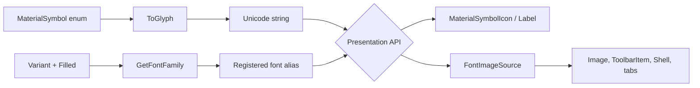

# Architecture

MaterialSymbols.Maui is a thin adapter between Google's icon-font codepoints and .NET MAUI's font and image abstractions. It has no lookup service, reflection, or runtime file I/O.

## Rendering flow

The symbol enum stores the actual Unicode codepoint as its numeric value. `ToGlyph()` converts it to a UTF-16 string. Independently, `GetFontFamily()` maps the selected shape and filled state to one of six aliases. Rendering succeeds when the glyph and its matching registered font family reach MAUI together.

## Build-time font delivery

NuGet imports `buildTransitive/MaterialSymbols.Maui.targets` into a consuming project. When `UseMaui` is true, the target creates six `MauiFont` items pointing into the restored package and assigns each a stable alias. The MAUI build pipeline then bundles the font assets for the selected platform. Non-MAUI consumers can reference the assembly, but the target deliberately adds no font assets.

## Startup registration

`UseMaterialSymbols()` calls `ConfigureFonts` with the same six filenames and aliases. This makes the aliases known to MAUI's runtime font registrar. The package target and startup extension have different responsibilities: the target makes files available to the app build; the extension registers how library code refers to them.

The demo uses a project reference rather than an installed package, so NuGet does not import the package's `buildTransitive` folder. Its project explicitly links the library's six font files as `MauiFont` items while still calling `UseMaterialSymbols()`.

## Presentation paths

`MaterialSymbolIcon` is the control path. Its three bindable properties share one callback, which replaces the inherited label's `Text` and `FontFamily`. This supports binding and triggers without allocating an image source.

`SymbolExtension` is the XAML image path. Its `ProvideValue` method delegates to `MaterialSymbolImageSource.Create`, producing a `FontImageSource` for any property typed as `ImageSource`. The C# factory exposes the same path without XAML.

Assembly-level `XmlnsDefinition` and `XmlnsPrefix` attributes map `http://schemas.materialsymbols.maui/2026/xaml` to the library namespace. Consequently consumers do not need to include a CLR namespace or assembly name in XAML.

## Static fonts and variants

Google distributes variable fonts with `FILL`, `GRAD`, `opsz`, and `wght` axes. Variable-font behavior is not consistent across every MAUI platform, so generation freezes six predictable instances:

- `opsz=24`
- `wght=400`
- `GRAD=0`
- `FILL=0` or `FILL=1`

Outlined, Rounded, and Sharp are separate upstream font families. This yields a 3 × 2 mapping and keeps runtime selection to a simple alias lookup.

## Design constraints

- The package does not expose runtime weight, grade, or optical-size axes.
- Icon names are compile-time enum members, not arbitrary strings.
- Multiple upstream names may render the same codepoint.
- `MaterialSymbol.None` intentionally renders nothing.
- Color and size are presentation concerns and do not alter the generated fonts.
